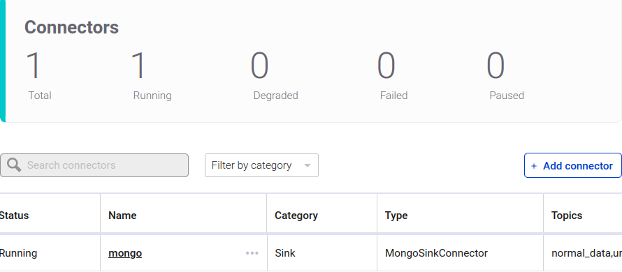
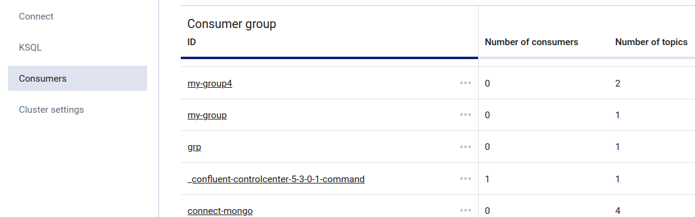

# Mongodb kafka demo


## Requirements:
  
   * Ubuntu 18.4
   * Docker 18.9+
   * Docker compose 1.24+
   * Python3

## Running the demo
 
 ### 1. Download/Clone the docker files from the GitHub repository
 
 #### [Github repo](https://github.com/sofienesafta/mongodb-kafka/)
 
 To run the demo issue ```sh run.sh```in docker folder which will:

  * Run ```docker-compose up```
  * Wait for MongoDB, Kafka, Kafka Connect to be ready
  * Register the Confluent Mongodb sink Connectors
  * Create 2 kafka Topics normal_data and urgent_data
  * Create a kafka Consumer of nurse_group to send a real-time email Alert message related to urgent_data topic.
  
  
### 2. Run the python data generator application
   run ```pip install -r requirements.txt```in a new shell. Then 
   run ```python3 Gateway.py``` to start generating fake data to mongodb collections in ```patient``` database and read data from ```heart.csv``` and send them to Kafka Topics.

### 3. Access Control in Mongodb
  
   IN ```auth_users.js```file 3 users are created with the fllowing usernames : ```root``` ,```doctor``` and ```care_maker``` with access control for each user.
   
   Issue this command line ```sudo docker-compose exec mongo bash``` to execute commands inside the ```mongo``` container then type : ```mongo < docker-entrypoint-initdb.d/auth_users.js```
   
  To examine the access control of each user type inside mongo container : ```mongo -u <username> -p <password> --authenticationDatabase <database>```
  
  The password fo each user is his username. ***exp***: ```mongo -u doctor -p doctor --authenticationDatabase patient```  allows to login as the doctor user.
  
It is useful ton install mongodb compass for better visualization of databases , collections and the access control of subscribers.

To install Mongodb Compass follow this [install mongodb compass](https://www.mongodb.com/docs/compass/current/install/)

To connect to mongodb via Compass follow [these steps](https://www.mongodb.com/docs/compass/current/connect/authentication-connection/)

***NB***: Choose the ```Username/Password method```. To connect with doctor or care_maker users specify the authentication database as ```patient```


### 4. Monitoring kafka components with Control center API:

Examine the topics, connectors installed, consumers in the Kafka control center [http://localhost:9021/](http://localhost:9021/)


To examine your MnogoSinkConnector go to the ```Connect``` button on the left, then click on ```connect-default```. It shows the status of your connectors. If it is running then the transfer of messages to mongodb database has been succefully done.


If the connector is not running (degraded) issue ```sudo docker logs connect``` to get some details about the reason of the connector failre.

You can click also on the name of the connector (```mongo```), then click on ```Settings``` to make changes on your Connector settings

To examine the Mongo Connector consumption of topics messages, click on ```Consumers``` button on the left.Then click on the group_ID of the connector-cosumer.Exp : ```connect-mongo``` in the figure bellow.


You can as well examine your Kafka Topics. Just click on Topics on the left.
